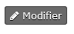

# 03 - Création d'un individu

## 001 - Créer une fiche uniquement avec les champs obligatoires à partir du menu « Accueil »

1. Cliquez sur l’icône « Nouvel individu / Particulier » sur la page d’accueil.
2. Commencez la création d’une fiche sur la page qui s’ouvre.
3. Cliquez sur la fenêtre intitulée « Choisir le Foyer ou l'Organisation d'appartenance ».
4. Faites le choix dans la liste déroulante.
5. A la ligne Statut Individu, faites le choix (Adulte ou enfant) en cliquant dans la pastille correspondant à votre choix.
6. Dans le bloc d’information « Civilité », cochez la pastille correspondant à la Civilité et au Genre.
7. Renseignez le lien avec la paroisse, en cochant le bouton correspond.
8. Remplissez les autres champs et listes déroulantes.
9. Cliquer sur la fenêtre grise « Enregistrer ».
10. CONFIRMEZ que les informations ont été prises en compte en recherchant la fiche de l’individu.

## 002 - Créer une fiche en omettant 1 champ obligatoire à partir du menu « Accueil »

1. Cliquez sur l’icône « Nouvel individu / Particulier » sur la page d’accueil.
2. Cliquez sur la fenêtre intitulée « Choisir le Foyer ou l'Organisation d'appartenance ».
3. Cliquez sur la fenêtre grise « Enregistrer ».
4. CONFIRMEZ qu’un message d’erreur s’affiche.
5. Cliquez sur l’icône « Nouvel individu / Particulier » sur la page d’accueil.
6. Allez jusqu’à la partie intitulée : Statut Individu.
7. Faites le choix (Adulte ou enfant) en cliquant dans la pastille correspondant à votre choix.
8. Cliquez sur la fenêtre grise « Enregistrer ».
9. CONFIRMEZ qu’un message d’erreur s’affiche.
10. Cliquez sur l’icône « Nouvel individu / Particulier » sur la page d’accueil.
11. Allez jusqu’à la partie intitulée : « Civilité ».
12. Cochez les pastilles correspondantes à Civilité et à Genre.
13. Cliquez sur la fenêtre grise « Enregistrer ».
14. CONFIRMEZ qu’un message d’erreur s’affiche.
15. Cliquez sur l’icône « Nouvel individu / Particulier » sur la page d’accueil.
16. Allez jusqu’à la partie intitulée : Liens avec la Paroisse.
17. Cochez la pastille correspondante.
18. Cliquez sur la fenêtre grise « Enregistrer ».
19. CONFIRMEZ qu’un message d’erreur s’affiche.

## 003 - Valider le formulaire rempli intégralement et vérifier le bon résultat champ par champ à partir du menu « Accueil »

1. Cliquez sur l’icône « Nouvel individu / Particulier » sur la page d’accueil.
2. Commencez la création d’une fiche sur la page qui s’ouvre.
3. Cliquez sur la fenêtre intitulée Choisir le Foyer ou l'Organisation d'appartenance.
4. Faites le choix dans la liste déroulante.
5. Statut Individu : Faites le choix (Adulte ou enfant) en cliquant dans la pastille correspondant à votre choix.
6. Renseignez les deux fenêtres Nom des parents, Nom des frères et sœurs avec les listes déroulantes.
7. Dans le bloc d’information « Civilité », cochez les pastilles correspondantes à la Civilité et au Genre.
8. Par la suite renseignez les fenêtres suivantes : Nom de famille et Nom de naissance.
9. Faites le choix dans le calendrier pour renseigner la Date de naissance.
10. Renseignez la fenêtre Lieu de naissance.
11. Renseignez les fenêtres de bloc Information Contact : Téléphone Portable Personnel, Téléphone Professionnel, Courriel Personnel, Courriel professionnel, Métier.
12. Renseignez les Liens avec la Paroisse en cochant la pastille correspondante.
13. Renseignez les listes déroulantes Groupes et Etiquettes.
14. Informations sur le couple : renseignez les fenêtres proposées, pour les informations suivantes :
    a. Sélectionner le conjoint ou partenaire
    b. Type de relation
    c. Date du mariage
    d. Date de la bénédiction nuptiale
    e. Paroisse de mariage
    f. Verset de mariage
    g. Divorcé ?
    h. Date de divorce
    i. Date de veuvage
15. Informations sur la religion : renseignez les fenêtres proposées, pour les informations suivantes :
    a. Religion
    b. Date de présentation
    c. Paroisse de présentation
    d. Date de baptême
    e. Paroisse de baptême
    f. Verset de baptême
    g. Date de confirmation
    h. Paroisse de confirmation
    i. Verset de confirmation
16. Informations sur les musiciens : renseignez les fenêtres proposées, pour les informations suivantes :
    a. Compétence Musique : instrument
    b. Compétence Musique : voix
    c. Numéro de Sécurité Sociale
    d. Numéro Guso
    e. Fonctionnaire ?
17. Cliquez sur la fenêtre grise « Enregistrer ».
18. Recherchez et ouvrez la fiche ainsi crée.
19. CONFIRMEZ que la fiche contient correctement l’ensemble des renseignements que vous avez saisis ci-dessus.

## 004 - Liste des paroisses

1. Commencez la création d’un nouvel Individu, à partir du bouton sur la page d’accueil.
2. CONFIRMEZ la présence des paroisses suivantes dans la liste des paroisses, dans les champs "Lieu de…" (mariage, présentation, baptême, etc…) :
    * Strasbourg
    * Mulhouse
    * Sondernach
    * Saint-Avold
    * Bouxwiller

## 005 - Règles de validation Conjoints

1. Créez un nouvel Individu avec le formulaire de création disponible sur la page d'accueil
2. A la partie « Sélectionner le conjoint ou partenaire », choisissez le nom d'un conjoint, sans indiquer si c'est un "Conjoint de" ou un "Partenaire de".
3. Validez la saisie.
4. CONFIRMEZ qu'un message d'erreur s'affiche demandant à renseigner le type de relation.
5. Recommencez la création cette fois-ci en indiquant le type de relation, mais sans indiquer le nom du conjoint.
6. CONFIRMEZ qu'un message d'erreur s'affiche demandant à renseigner le nom du conjoint.
7. Corrigez la saisie en remplissant le nom du conjoint.
8. Validez la saisie.
9. CONFIRMEZ que le message d’erreur ne s’affiche plus.

## 006 - Règle de validation Mail

1. Créez un nouvel Individu avec le formulaire de création disponible sur la page d'accueil.
2. Renseignez le champ Mail, en indiquant une adresse mail sans écrire le @ (arobase).
3. Validez la saisie.
4. CONFIRMEZ qu'un message d'erreur s'affiche demandant à corriger la saisie.
5. Recommencez la création cette fois-ci en mettant des accents ou des caractères spéciaux dans l’adresse mail.
6. CONFIRMEZ qu'un message d'erreur s'affiche demandant à corriger la saisie.
7. Corrigez la saisie en remplissant le mail correctement.
8. Validez la saisie.
9. CONFIRMEZ que le message d’erreur ne s’affiche plus.

## 007 - Règle de validation Lien enfants - parents

1. Créez un nouvel Individu avec le formulaire de création disponible sur la page d'accueil.
2. Indiquez que l’Individu est un Enfant, et pas un Adulte, dans le champ Statut Individu. Mais ne renseignez pas le nom des parents.
3. Validez la saisie.
4. CONFIRMEZ qu'un message d'erreur s'affiche demandant à corriger la saisie.
5. Corrigez la saisie en remplissant le nom des parents.
6. Validez la saisie.
7. CONFIRMEZ que le message d’erreur ne s’affiche plus.

## 008 - Règle de validation Lien Fonctionnaire & Guso

1. Créez un nouvel Individu avec le formulaire de création disponible sur la page d'accueil.
2. Indiquez un numéro GUSO tout en bas du formulaire. Mais ne renseignez pas le champ Fonctionnaire.
3. Validez la saisie.
4. CONFIRMEZ qu'un message d'erreur s'affiche demandant à corriger la saisie.
5. Corrigez la saisie en remplissant le champ Fonctionnaire.
6. Validez la saisie.
7. CONFIRMEZ que le message d’erreur ne s’affiche plus.

## 009 - Création de l'adresse

1. Créez un nouvel Individu à partir du bouton en page d'accueil, en le rattachant à un foyer existant (et pour lequel une adresse est enregistrée).
2. Renseignez les autres champs obligatoires de la fiche.
3. A la fin de la création, recherchez la fiche de ce nouvel individu. 
4. CONFIRMEZ que l'adresse du Foyer est correctement renseignée sur la fiche de l'Individu.

## 010 - Rajouter une photo à un individu

1. Allez dans la fiche individuelle d’un individu.
2. Cliquez sur Modifier .
3. Dans le bloc « Fiche contact », cliquez sur « Parcourir » (Parcourir/télécharger une image).
4. Enregistrez.
5. CONFIRMEZ que la photo est visible sur la fiche de l’Individu.

## 011 - Rajouter une Note à un Individu

1. Allez dans la fiche individuelle d’un individu.
2. Cliquez sur le champ .
3. Créez une nouvelle note.
4. Enregistrez.
5. CONFIRMEZ que la note est visible sur la fiche individuelle de contact.

## 012 - Rajouter une relation à une fiche existante

1. Ouvrez une fiche Individu.
2. Rajoutez une relation avec une autre fiche.
3. CONFIRMEZ que la relation est visible sur la fiche de l’Individu.
4. Ouvrez la fiche avec laquelle la relation a été créé.
5. CONFIRMEZ que la relation est également visible sur l’autre fiche.
6. Ouvrez une fiche Foyer.
7. Recommencez les points 2 à 5 (avec une autre relation).
8. Ouvrez une fiche Organisation (la créer si besoin).
9. Recommencez les points 2 à 5 (avec une autre relation).

## 013 - Supprimer une relation à une fiche existante

1. Ouvrez une fiche Individu.
2. Supprimez une des relations existantes.
3. CONFIRMEZ que la Relation n’est pas visible en tant que relation active.
4. Allez sur l’autre fiche qui était en relation.
5. CONFIRMEZ que la Relation n’est plus non plus visible.

## 014 - Supprimer un Individu de la base

1. Ouvrez une fiche Individu.
2. Cliquez sur le bouton Actions.
3. Choisissez Supprimer.
4. Validez la suppression.
5. CONFIRMEZ que la fiche est marquée avec un trait rouge barré.
6. Effectuez une recherche de la fiche.
7. CONFIRMEZ que la fiche n’est pas visible.
8. Allez dans Rechercher / Recherche avancée (bandeau noir en haut de l’écran).
9. Saisissez le nom de la fiche supprimée dans « Nom complet ou partiel ».
10. Dans les « Critères de base », cliquez sur Rechercher dans la corbeille (Search Deleted Contacts).
11. Cliquez sur Rechercher.
12. CONFIRMEZ que la fiche est visible.

## 015 - Restaurer un Individu supprimé par erreur

*Ce test est à effectuer après avoir effectué le test ci-dessus (« Supprimer un Individu de la base »)*

1. Allez dans Rechercher / Recherche avancée.
2. Saisissez le nom de la fiche concernée dans « Nom complet ou partiel ».
3. Dans les « Critères de base », cliquer sur Rechercher dans la corbeille (Search Deleted Contacts).
4. CONFIRMEZ que la fiche est visible.
5. Cliquez sur la fiche.
6. Cliquez sur le bouton Restaurer de la Corbeille.
7. Validez la restauration de la fiche.
8. CONFIRMEZ que la fiche n’est pas plus barrée de rouge.
9. CONFIRMEZ que les anciennes relations sont bien à nouveau affichées.

## 016 - Supprimer un Individu définitivement de la base

1. Reproduisez les étapes du test 015 « Supprimer un Individu de la base ».
2. Allez dans Rechercher / Recherche avancée.
3. Saisissez le nom de la fiche concernée dans « Nom complet ou partiel ».
4. Dans les « Critères de base », cliquez sur Rechercher dans la corbeille (Search Deleted Contacts).
5. CONFIRMEZ que la fiche est visible.
6. Cliquez sur la fiche.
7. Cliquez sur le bouton « Supprimer définitivement ».
8. Effectuez une recherche de la fiche.
9. CONFIRMEZ que la fiche n’est pas visible.
10. Allez dans Rechercher / Recherche avancée.
11. Dans les « Critères de base », cliquez sur Rechercher dans la corbeille (Search Deleted Contacts).
12. CONFIRMEZ que la fiche est n’est plus visible.

## 017 - Fusionner deux fiches du même individu

*Ce test sera documenté prochainement, merci d’y revenir ultérieurement.*
