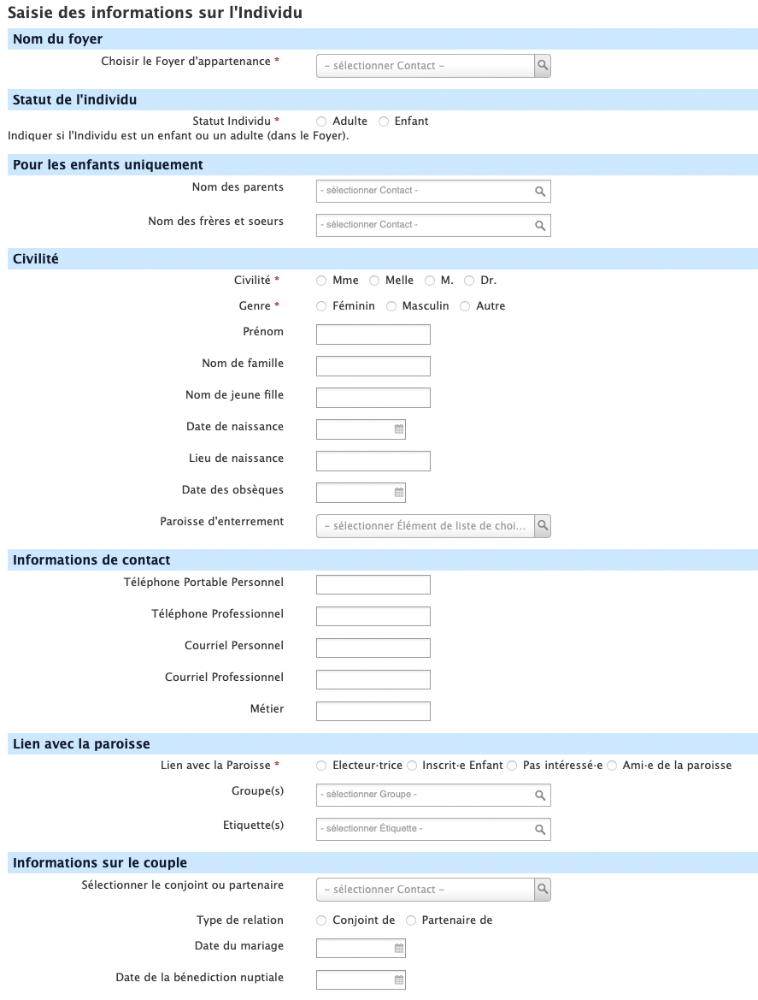

# 2. Débuter

!!! warning "Attention"
    Avant de créer une fiche "individu", vérifiez que la fiche "foyer" à laquelle elle sera liée existe déjà, sinon créez d'abord la fiche "foyer".

## 2.1. Enregistrer un nouveau foyer

!!! warning "Attention"
    N'utilisez pas le menu "Contact" -> "Nouveau foyer" mais suivez la procédure ci-desssous.
    Elle utilise un formulaire spécialement élaboré pour les paroisses.

Pour créer un nouveau "foyer" vous devez passer par la page d'accueil (voir [Mode d'emploi#1 2 1 La page d'accueil](1_introduction.md#121-la-page-daccueil)) et cliquez sur l'icône "Enregistrement des nouveaux foyers".

Vous obtiendrez la fenêtre suivante :

Les indications du formulaire devraient être suffisamment pour clair pour que vous sachiez comment le compléter.

Notez juste que nous entendons par quartier un secteur géographique.

## 2.2. Enregistrer un nouvel individu

Contrairement à la fiche foyer, nous avons ici un large panel d'informations que nous pouvons enregistrer.

Le premier élément important est de relier l'individu à une fiche "foyer" en choisissant le foyer d'appartenance.

Si vous ajoutez un enfant, en choisissant ses parents et ses frères et soeurs, les relations seront automatiquement établies.

N'hésitez pas à consulter les recommandations sur le **lien avec la paroisse** si vous avez un doute sur le lien à établir.

Il est recommandé de noter les compétences lorsqu'elle sont connues, pour inviter par exemple la personne par la suite à venir renforcer la chorale ou un groupe de musique.

Les éléments de Sécurité sociale, Guso ou de savoir si la personne est fonctionnaire ne sont réellement utiles que pour la fiche d'un salarié de la paroisse.

## 2.3. Les relations

Les relations explicitent le lien entre des individus mais aussi entre des individus et la paroisse ou des individus et des associations que vous aurez enregistrées.
CiviParoisse en propose de nombreuses, que nous pouvons classer par catégorie :

* Familiales :
	* Enfant de
	* Parent de
	* Conjoint de
	* Partenaire de
	* Grand parent de
	* (...)
* D'appartenance :
	* Chef de famille de
	* Membre du foyer
* De fonction ou élection :
	* est Membre élu.e de
	* est pasteur de
	* est Délégué.e de
	* est Président.e de
	* est Secrétaire de
	* est Trésorier.ère de
	* (...)

Ceci va vous permettre de tisser assez finement les liens entre les uns et les autres.

!!! note "Conseil"
    Vous pouvez ainsi enregistrer la relation entre les membres du Conseil presbytéral et la paroisse (en créant au préalable une fiche organisation au nom de la paroisse).
    Pour des relations de ce genre, il est conseillé de mettre la date de l'élection ou de prise de fonction et la date de fin si elle est déjà connue.

Fin d'une relation, deux cas possibles :

* vous aviez indiqué une date de fin et la relation se désactivera automatiquement.
* il n'y avait pas de date de fin, il suffit alors de cliquer à la fin de la ligne de la relation sur "plus" puis sur "modifier" et ajouter une date de fin.

CiviParoisse garde mémoire des relations, c'est ainsi que les relations qui ont pris se retrouvent en bas des relations actives, dans la rubrique "Relations inactives".

## 2.4. Les groupes

### 2.4.1. les groupes classiques

Après les relations, les groupes sont une autre façon d'établir un lien entre des personnes, de dire qu'elles partagent quelque chose, une activité par exemple.
Vous pouvez ainsi créer un groupe qui recense tous les membres de la chorale, un autre pour les catéchètes, ou encore pour les participants au groupe biblique.

Pour créer un groupe statique, il vous suffit d'aller dans le menu "Contacts", puis "Gestion des groupes".

En cliquant sur "Ajouter un groupe" vous obtenez la fenêtre suivante :

Il est recommandé d'utiliser un nom explicite et d'ajouter une description pour que la personne qui n'identifie pas le groupe par son nom puisse retrouver le bon groupe par un texte plus long et détaillé.

!!! warning "Attention"
    Ne cochez pas "contrôle d'accès"
    En revanche, si vous envisagez d'envoyer des courriels aux membres du groupe, il sera indispensable de cocher "Liste de diffusion".
    Si vous voulez juste visualiser les membres sans leur écrire, ne cocher aucun des deux.

Vous pouvez même, comme vous l'avez sans doute remarqué, créer des sous groupes en indiquant lors de la création du sous groupe quel est son groupe parent.

Vous ajoutez ensuite des membres au groupe depuis leur fiche, onglet "Groupes".

C'est depuis la "Gestion des groupes" que vous pouvez visualiser les membres en cliquant sur "Contacts" à la fin de la ligne du groupe.

### 2.4.2. Les groupes dynamiques

Il existe cependant un autre type de groupes, les groupes dynamiques où vous n'ajoutez pas les personnes manuellement mais où elles se retrouvent automatiquement dans ce groupe de part leur âge, une relation ou tout autre élément rechargeable.

Il s'agit donc tout d'abord d'effectuer une recherche (voir "Faire des recherches pour des conseils pour vous aider à retrouver les fiches selon divers critères").

Une fois la liste des contacts obtenue, sélectionnez tout d'abord l'ensemble des contacts en cliquant sur "Sélection des enregistrements : Les x trouvés". Puis cliquez sur "Actions" et choisissez "Groupe - créer un groupe dynamique", donnez lui un nom, une description et cochez ou non "Liste de diffusion"
Désormais, dès qu'un contact rempli les critères de la recherche il est automatiquement ajouté au groupe, et inversement, si pour un contact du groupe un critère n'est plus rempli, il ne sera plus membre du groupe.
