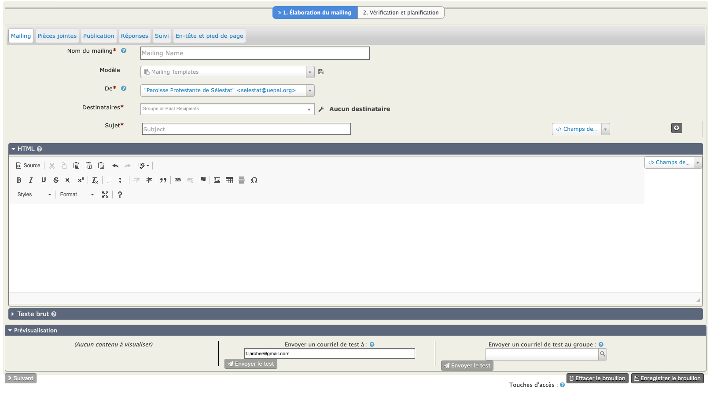
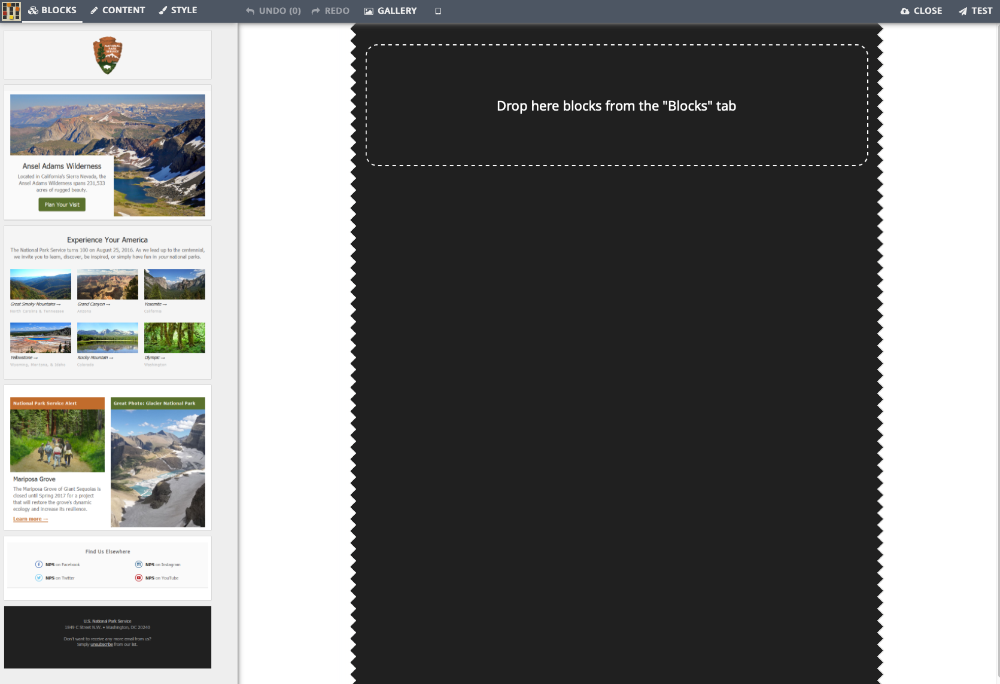

# Envoyer un courriel

PARTIE A REVOIR POUR SEPARER LES COURRIELS ENVOI IMMEDIAT ET COURRIELS MAILING

CiviParoisse propose deux formes de courriels, l'une qui ressemble à ce que vous connaissez dans votre logiciel de courriel habituel, l'autre qui permet des présentations bien plus élaborées, tout en étant relativement simple à mettre en oeuvre. Cette deuxième solution est recommandée pour vos lettres électroniques, la première étant plutôt pour des courriels simples n'ayant pas besoin d'une grande esthétique.

!!! warning "Attention" 
    Une autre différence importante est le nombre de destinataires. 
    Pour un **envoi immédiat**, il est nécessaire d'avoir moins de 50 destinataires.
    Un **envoi massif** est possible à tout moment et imposé au-delà de 50 destinataires. Il est également possible d'en planifier l'envoi. Cela vous évitera d'être blacklistés, c'est à dire considéré comme spameurs. Ce qui aurait pour effet assez rapidement que soit vos courriels soient considérés comme "indésirables" (spam) ou pire n'arrivent pas du tout. CiviParoisse n'envoie pas les messages de la même façon dans les deux cas.

Pour envoyer un courriel, vous pouvez partir d'une liste de contacts suite à une recherche effectuée. Dans ce cas sélectionnées les contacts voulus puis cliquez sur "Actions" et choisissez **"Courriel - envoi immédiat"** ou **"Courriel - planifier/envoyer un envoi massif"**, selon le nombre de destinataires.

Mais vous pouvez aussi procéder des deux façons détaillées ci-après.

## Courriel classique ("Courriel - envoi immédiat")

Pour par exemple inviter les conseillers presbytéraux à la prochaine réunion, le contenu sera plus important que le contenant et aussi par souci écologique (les illustrations ont un coût en CO2), vous opterez sans doute pour le courriel classique qui permet déjà d'appliquer du gras, de l'italique, de placer un tableau, une image, d'ajouter des pièces jointes, etc.

Pour y accéder, cliquez sur "Mailings" et choisissez en bas de la liste `New Mailing (Traditional)`.

Dans la nouvelle fenêtre, indiquez un nom du mailing (ce nom se retrouvera, une fois le courriel envoyé, dans l'onglet "Activités" de chaque destinataire. Prenez par conséquent un nom suffisamment explicite pour qu'il vous parle encore des mois plus tard).
Vous pouvez choisir d'utiliser un "Modèle" de courriel si vous avez déjà créé un.
Le champ "De" comporte en principe l'adresse courriel de votre paroisse.

Dans "Destinataires" vous allez pouvoir choisir un groupe (si pour ce groupe il est bien coché "Liste de diffusion")

Le "Sujet" correspond à ce qui est parfois "Objet" du courriel dans certains logiciels. C'est l'intitulé du courriel tel qu'il s'affichera chez vos destinataires.

Vous pouvez opter pour un message en "texte brut" qui n'aura alors aucune fioriture ou en "html" qui vous permet d'utiliser pleinement les possibilités de mise en forme du contenu.

N'hésitez pas à consulter les différents onglets pour ajouter par exemple une pièce jointe ou pour ajouter l'entête de votre paroisse et en pied de page une signature que vous aurez pré enregistrée.

Observez bien le bouton au centre bas de la fenêtre vous permettant d'envoyer un courriel de test. Cela vous sera utile si vous avez mis en place une esthétique élaborée et que vous voudrez vérifier que le contenu est bien conforme à vous attentes, avant d'envoyer le courriel à l'ensemble des destinataires.

!!! note "Astuce"
    CiviParoisse permet de faire du publipostage, vous pouvez donc ajouter par exemple les champs "Formule de salutation par courriel" suivi du champ "nom affiché" pour obtenir pour chaque destinataire quelque chose du type "Bien cher M. DUPONT Martin,".

Un fois le courriel préparé, cliquez sur l'onglet "Vérification et planification" pour choisir si vous l'envoyez immédiatement ou de façon planifiée.

## Courriel plus esthétique

Si votre paroisse diffuse une lettre électronique d'information en complément du bulletin paroissiale, vous voudrez sans doute que l'oeil du futur lecteur soit attiré par une présentation plus recherchée. Là encore, civiParoisse vous permet de le faire.

Pour y accéder, cliquez sur "Mailings" et choisissez en haut de la liste "Nouveau mailing".

Toute une partie est identique au mailing traditionnel et ne sera donc pas répétée ici.

Concentrons nous sur l'élaboration du contenu. Cliquez sur le modèle que vous avez prédéfini pour le choisir ou sur "Empty Template" pour créer un modèle.

Vous obtiendrez la fenêtre suivante :

Pour créer votre propre modèle, glissez-déposez un "bloc" (ou en cliquant sur le bouton "Add" qui apparait lorsque la souris ce place sur un bloc) de la gauche vers la droite. Vous pourrez les réarranger à volonté. Vous pouvez ensuite personnaliser les différents blocs, placer déjà du texte et des illustrations que vous utiliserez à chaque envoi et prévisualiser le résultat.
A gauche de chaque bloc se trouve une icône pour le dupliquer et une autre pour le supprimer si vous décidez d'une autre présentation.

Si vous cliquez sur certains éléments, la partie de droite change d'affichage pour vous permettre de personnaliser l'élément (par exemple pour indiquer la page Facebook de la paroisse).

N'oubliez pas d'enregistrer le tout pour avoir un modèle prêt à l'emploi pour les prochains envois.
