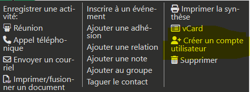
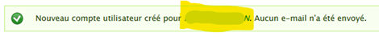
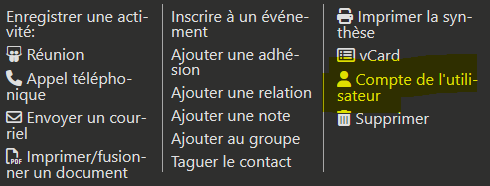

# Gestion de la base de données

!!! warning "Attention"
    Cette partie est destinée aux administrateurs locaux de la base de données.

## Gérer les accès à CiviParoisse

### Donner accès à la base de données pour un nouvel utilisateur

Vous pouvez à tout moment donner accès à la base de données à un utilisateur.

**Pour mettre en place l’accès :**

1. Au préalable
      * Si ce n’est pas encore fait, créer la fiche de l’utilisateur dans la base de données
      * Si ce n’est pas encore faire, renseigner l’adresse mail de l’utilisateur
2. Ouvrir la fiche *Particulier* de la personne (pas la fiche *Foyer*)
3. Cliquer sur le bouton *Actions* de la fiche 
4. Choisir l’entrée *Créer un compte utilisateur* 
5. Renseigner l’écran *Créer un compte utilisateur*
      * **Nom utilisateur** : c’est le nom qui servira pour se connecter. Il est recommandé de choisir le prénom + nom de l’utilisateur
      * **Mot de passe** : il est important que le mot de passe contienne au moins une majuscule, une minuscule, un chiffre et un caractère spécial. Pour garantir la sécurité de vos données, la longueur doit être de plus de 8 caractères.
      * Cliquer sur le bouton **Ajouter**
6. Cliquer sur le nom de l’utilisateur dans l’écran de confirmation 
7. Cliquer sur le bouton *Actions* de la fiche 
8. Cliquer sur *Compte de l'utilisateur* 
9. Cliquer sur l’onglet *Modifier* 
10. Dans la partie **Rôles**, choisir le ou les rôle(s) à donner à l'utilisateur, parmi la liste suivante
      * **Administrateur** : possibilité de gérer tout le site (Drupal comme CiviCRM). Réservé à l'équipe technique de CiviParoisse.
      * **Gestionnaire** : accès à l'ensemble de CiviParoisse en consultation et en modification, sans les données financières, ni l'envoi de mailing de masse ou l'administration du site. Ce rôle permet également de créer et gérer les droits d'accès à CiviParoisse.
      * **Utilisateur paroissial** : accès à CiviParoisse uniquement en consultation, sans les données financières, et sans l'envoi de mailing de masse. Ce rôle peut tout de même enregistrer des événements, des activités, des notes. Il peut préparer des mailings, sans pouvoir en valider l'envoi. Il peut aussi créer de nouvelles fiches (sans pouvoir les modifier).
      * **Gestionnaire Mot de passe** : option qui permet de réinitialiser les mots de passe des utilisateurs. Attention, cette option permet également de créer et gérer les droits d'accès à CiviParoisse.
      * **Financier** : option qui permet de modifier et consulter les données financières.
      * **Envoi de mailing** : option qui permet d'envoyer les mailings de masse.
11. Cliquer sur Enregistrer
12. Transmettre le mot de passe à l’utilisateur, il pourra se connecter immédiatement.

!!! warning "Attention"
    Selon le rôle que vous donnez à l'utilisateur, il aura accès à plus ou moins d'informations stockées dans la base de données. Il est donc fortement recommandé de ne pas diffuser largement un rôle *Gestionnaire*, ceci afin de préserver la confiance de vos paroissiens quant aux données personnelles que vous recueillez.

### Supprimer l’accès à la base de données à un utilisateur existant

!!! warning "Attention"
    Il est important de vérifier régulièrement que la liste des personnes ayant accès à la base de données corresponde bien à la réalité de votre paroisse. Un utilisateur ayant toujours accès à la base de données alors qu’il ne s’en sert plus représente un risque potentiel pour la sécurité de votre base de données. Il est donc important de supprimer rapidement les accès qui ne sont plus nécessaires.

**Pour supprimer l’accès à un utilisateur existant :**

1. Ouvrir la fiche *Particulier* de la personne (pas la fiche *Foyer*)
2. Cliquer sur le bouton *Actions* de la fiche 
3. Cliquer sur *Compte de l'utilisateur* 
4. Cliquer sur l’onglet *Modifier* 
5. Dans la partie **Statut**, choisir *Bloqué* 
6. Dans la partie **Rôles**, décocher le ou les rôle(s)
7. Cliquer sur *Enregistrer*

> Le nom de l’utilisateur dont vous voulez supprimer l’accès restera affiché dans la liste des personnes. De même, sa fiche restera présente dans la base de données. Ceci permet de conserver l’historique des modifications faite par cet utilisateur.

### Lister l'ensemble des utilisateurs de la base de données

En cours d'écriture

## Modifier la liste des Quartiers

Dans le menu Paroisse, cliquer sur le menu Paramètres.

Dans la page des Paramètres de CiviParoisse qui s'ouvre, sélectionner *Modifier la liste des Quartiers*

* Si vous souhaitez modifier le nom d'un quartier :

  1. Cliquer sur le nom du quartier à modifier
  2. Saisir le nouveau nom
  3. Cliquer sur la flèche verte sous le nom

* Si vous souhaitez ne plus utiliser un quartier existant :

  1. Vérifier au préalable qu'aucun Foyer n'est encore attaché à ce quartier
  2. Dans la colonne *Visible ?*, cliquer sur `Oui`
  3. Choisir le bouton `Non`
  4. Cliquer sur la flèche verte

* Si vous souhaitez utiliser à nouveau un quartier actuellement Non visible :

  1. Dans la colonne *Visible ?*, cliquer sur `Non`
  2. Choisir le bouton `Oui`
  3. Cliquer sur la flèche verte
