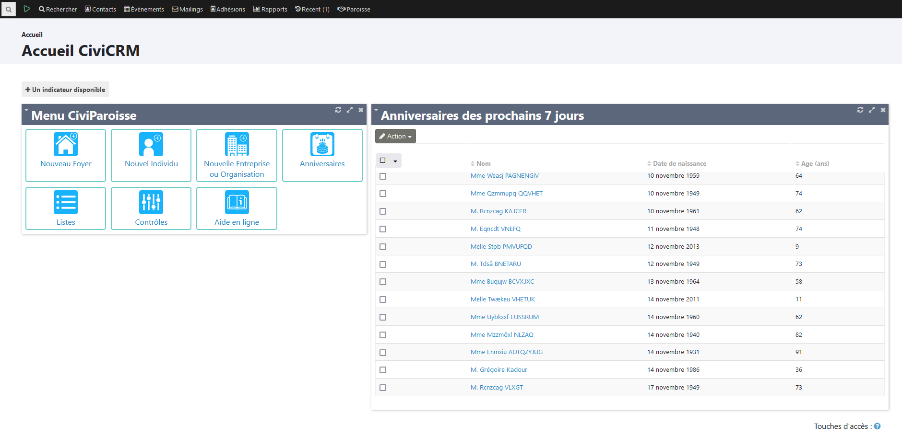

# Introduction
## Quelques principes de base
### Trois types de fiches à distinguer dans la base
Votre fichier paroissial va s'articuler autour de trois **types** de fiches dont deux que vous connaissez peut être déjà par l'utilisation de votre téléphone ou logiciel pour gérer vos courriels : **individu** et **organisation**.
CiviParoisse ajoute un troisième type : le **foyer** .

Pas d'inquiétude, vous allez pouvoir identifier le type de contact aisément par son icône :

* le **foyer** :   qui est le lieu où vivent un certain nombre de personnes ayant au minimum comme **relation** d'habiter dans le même foyer fiscal, mais qui souvent auront aussi des liens familiaux que CiviParoisse sait enregistrer.
* l'**individu** :  qui comme son nom l'indique va être la fiche de contact de chaque individu que nous estimons important de garder dans notre fichier.
* l'**organisation** :  qui pourra être la fiche de contact d'une paroisse, d'une association avec laquelle on est souvent en relation, de l'entreprise qui entretien le chauffage du presbytère...

### Quelles données vont dans quelle fiche ?

Dans la fiche « Foyer » sont à noter les données qui ne changent pas d’un individu à l’autre au sein d'un même foyer. Et les données personnelles sont à indiquer dans la fiche « Individu ». Le tableau ci-dessous montre de façon non exhaustive la répartition.

| Fiches | Foyer | Individu |
| ----- | :----: | :---: |
| Adresse postale | ✅  | (lien vers l'adresse du foyer) |
| Téléphone fixe | ✅ | |
| Site Internet | ✅ (si familial) | ✅ (si individuel) |
| Mode de communication préféré | ✅  | ✅ |
| Formules de communication foyer | ✅ | |
| Informations complémentaires (quartier) | ✅ | |
| Mode de distribution du journal | ✅ | |
| Courriel | | ✅ |
| Téléphone portable | | ✅ |
| Message instantanée | | ✅ |
| Formules de communication individuelles | | ✅ |
| Etat civil | | ✅ |
| Informations religion | | ✅ |
| Compétences | | ✅ |
| Groupes | | ✅ |
| Relation avec la paroisse | | ✅ |
| Participation à des événements | | ✅ |
| Dons à la paroisse | | ✅ |

### Relations et groupes                                                                                                         

CiviParoisse ne permet pas seulement de créer des fiches de contact, mais également d'établir des liens entres les fiches et de les rassembler en groupes.

Un enfant aura ainsi une **relation** comme "fils de" avec ses parents, un bénévole sera "bénévole de" pour une association ou un groupe d'activité.

Il vous est également possible de constituer un **groupe** (dynamique ou non, voir le point dédié aux groupes pour plus de détails). Le groupe pourra par exemple recenser tous les bénévoles de la paroisse, un autre les membres de la chorale, un autre encore les dames de l'ouvroir. Un groupe est de plus un bon moyen pour rassembler l'ensemble des personnes à qui vous allez envoyer régulièrement un courriel (par exemple les membres du conseil presbytéral).

!!! warning "Attention"
    Il est important de saisir toutes les relations dès la création d'une fiche, et de les faire évoluer dans le temps, pour bien identifier les interactions entre les personnes.

## Interface de CiviParoisse

### La page d'accueil

L'adresse votre page d'accueil est du genre : <https://nomparoisse.bdd.uepal.org>
Elle devrait ressembler approximativement à ceci :

Neuf éléments sont à identifier :

* En 1, nous avons l’icône en forme de maison qui nous permettra toujours de revenir à cette page en cliquant dessus. A noter que le menu qui prolonge cette icône est celui de Drupal et ne vous sera pas utile, en dehors du point 9 ci-dessous.
* En cliquant sur 2 nous accédons à CiviParoisse.
* L’icône 3 nous permet d’enregistrer un nouveau foyer en suivant le cadre spécifique à CiviParoisse. Il est indispensable de passer par ce cadre.
* L’icône 4 permet d’enregistrer un nouvel individu si la fiche « Foyer » dont il fait parti existe déjà. Sinon passer d’abord par le point 3.
* Le point 5 vous permet d’avoir une liste des anniversaires à venir, pour par exemple envoyer un petit mot et ainsi garder le lien avec les paroissiens.
* Le point 6 n’est pas encore fonctionnel, il permettra d’établir facilement différentes listes.
* Le point 7 donne accès à plusieurs outils permettant de vérifier que le fichier paroissial est complet et si non, d’y remédier. Il est conseillé de passer par ce point plusieurs fois dans l’année.
* Le point 8 donne accès au mode d’emploi de CiviParoisse.
* Enfin, le point 9 indique le nom de la personne connectée à CiviParoisse et à côté du non se trouve le bouton pour vous déconnecter quand vous avez fini d’intervenir sur le fichier paroissial. Il est fortement recommandé de le faire si vous utilisez un ordinateur ou un téléphone partagé avec d’autres personnes.

### Le menu principal de civiParoisse

Le menu de CiviParoisse est le deuxième, celui qui commence par l’icône d’une loupe à gauche. C’est à partir de lui que vous allez pouvoir réaliser les différentes opérations sur votre fichier paroissial.

Passons en revue les différents éléments :

* La loupe est un raccourci qui permet de rechercher rapidement une fiche, sans passer par une fonction « rechercher » plus évoluée, mais en choisissant sur quoi porte la recherche.
* L’icône en forme de triangle vert est animée lorsque CiviParoisse est en train d’effectuer une opération. Elle permet une recherche rapide sur tout texte entré. Elle permet de revenir à l’accueil.
* L’onglet « Rechercher » vous permet soit une recherche simple, soit une recherche avancée, soit encore une recherche dans le contenu. Ce sera souvent par là que vous chercherez à accéder à une fiche.
* L’onglet « Contacts » n’est pas à utiliser pour créer une fiche, puisque nous passons par un formulaire spécifique. C’est en revanche ici que vous pouvez gérer les groupes (Bénévoles, Acat, etc.).
* L’onglet « Contributions » va nous permettre d’enregistrer les dons puis d’éditer les reçus fiscaux.

* L’onglet « Événements » permet de créer un événement (voyage à Wittenberg ou repas paroissial, par exemple) et de gérer tout ce qui y sera lié.
* L’onglet « Mailings » permet, comme son nom l’indique, d’envoyer des courriels.
* L’onglet « Adhésions » permet d’enregistrer une nouvelle adhésion (mais il est conseillé de le faire au moment de la création de la fiche individuelle) et d’établir des statistiques sur les adhésions (d’où l’importance de le faire à la création pour avoir des dates réalistes).
* L’onglet « Rapports » permet d’établir diverses statistiques.
* L’onglet « Administrer » permet de paramétrer CiviParoisse. Ce menu est réservé aux personnes ayant les droits d'administration. N’y intervenir quand étant sûr de ce que l’on fait.
* L’onglet « Support » donne accès à une documentation sur CiviCRM qui est la documentation officielle et non celle élaborée par l’UEPAL.
* L’onglet « Récent » vous indique les dernières fiches créées.
* Enfin, l'onglet « Paroisse » reprend les entrées de menu que vous trouvez en page d'accueil.

Vous remarquerez que sous ce menu, à gauche, CiviParoisse vous indique toujours où vous êtes.

### L'interface de la fiche "foyer"

Vous l'avez sans doute déjà remarqué, une fiche foyer a comme une icône une maison. C'est sur sur cette fiche que nous enregistrons toutes les informations communes aux différents membres d'un foyer : l'adresse, le numéro de téléphone fixe ou encore le quartier pour le portage du bulletin paroissial.
Voici un aperçu d'une fiche foyer sur son onglet "synthèse" :

Nous détaillons les différentes onglets à partir de la fiche "individu".

### L'interface de la fiche "individu"

Remarquez d'emblée deux choses :

* une fiche de contact s'ouvre sur l'onglet "Synthèse" qui va vous afficher les éléments principaux de la fiche.

* elle se découpe en zones (ou onglets) et si vous cliquez dans l'une des zones (ou onglets) vous pouvez modifier les informations de cette zone. Notez que vous modifier l'ensemble en cliquant sous le nom et prénom sur "Modifier".

Elle comporte quelques éléments communs avec la ficher "foyer", s'y ajoutent, du fait que nous sommes là sur une fiche individu :

* Son adresse courriel personnelle s’il en dispose d’une ; de même que son numéro de téléphone mobile.
* L’adresse du foyer auquel il est rattaché (nous en dirons plus par la suite).
* Son genre, sa date de naissance et son âge.
* En bas à gauche les informations dont nous disposons sur son état civil.
* En bas à droite les informations dont nous disposons sur sa religion, date et lieu de baptême, etc.

Voyons maintenant les différents onglets de la fiche :

* Ils sont en bleu si la rubrique contient une information, en gris s’il n’y en a pas.
* « Synthèse » affiche une synthèse sur la fiche et correspond à la vue ci-dessus.
* « Contributions » affiche la liste des dons de la personne et permet d’en ajouter.
* « Engagements de dons » n’est pas utilisé actuellement mais permettrait d’enregistrer une promesse de dons.
* « Adhésion » est la rubrique qui contient l’indication du lien de la personne avec la paroisse et permet de l’ajouter ou la modifier.
* « Événements » indique si la personne participe à un événement de la paroisse.
* La rubrique « Activités » se remplie automatiquement et consigne toute interaction avec la personne (changement sur sa fiche de type « adhésion », envoi d’un courriel, etc.).
* La rubrique « Relations » indique toutes les relations connues de cette fiche avec d’autres fiches (« Parent de », « Membre de », « Chef de famille de », etc.). C’est là où nous pouvons en ajouter, supprimer ou modifier.
* « Groupes » : indique si l’individu fait parti d’un groupe de la paroisse et permet d’ajouter, modifier ou supprimer cet état.
* « Notes » : rubrique où nous enregistrons toute information utile ne trouvant pas sa place ailleurs. Il est utile de donner un non explicite à la note créée et d’indiquer la date de création.
* « Étiquettes » : indique les étiquettes attribuées à l’individu (Officiel, Maire, etc.). Cette partie sera retravaillée à l’avenir.
* « Journal des modifications » : enregistre automatiquement tout modification réalisée sur la fiche, même mineure.

**Comment modifier une fiche ?**

Deux solutions s’offrent à nous :

* Cliquez sur « Modifier » (en dessous du nom de la fiche), ce qui affichera la fiche au mode édition.
* Cliquez approximativement à l’endroit où se trouve l’information que vous voulez changer ou enregistrer. Ne pas oublier de cliquer sur « Enregistrer » avant de quitter.

**Autres éléments d'interface** :

* Le bouton « Actions » : placé sous le nom de la fiche, il permet d’effectuer rapidement certaines actions qui prendront cette fiche comme partie prenant : prévoir une réunion, appeler la personne, envoyer un courriel, etc.
* Le bouton « Supprimer contact » : il n’est à utiliser que si l’on est certain que cette personne a quitté la paroisse et que nous n’aurons plus de lien avec elles ! Vigilance donc. La fiche est placée dans une corbeille accessible uniquement par l’administrateur.
* Les boutons « Précédent / Suivant » : Ils permettent de naviguer entre les fiches, classées par ordre alphabétique.
