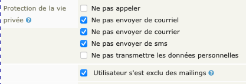
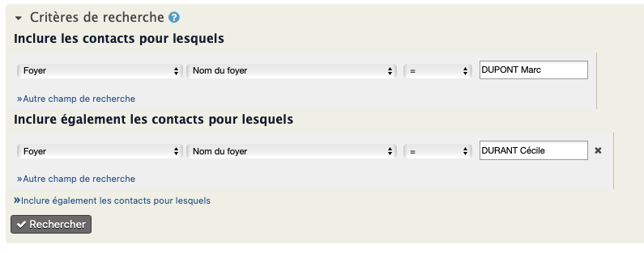

# Que faire quand... ?

## :material-human-male-female-child: Une nouvelle famille arrive ?

A l'arrivée d'une nouvelle famille au sein de la paroisse il vous faut suivre les étapes suivantes :

### Créer la fiche Foyer

Utilisez pour cela le formulaire spécifique accessible sur la page d'**Accueil** de CiviParoisse.
Merci de respecter les règles suivantes pour maintenir la cohérence des données au sein de votre base de données :

* Nom du Foyer : saisir le nom de famille en **majuscules**. Cas de figure :

  * NOM Prénom, pour un(e) célibataire (ex. : *DUPONT Marc*)
  * NOM Prénom et Prénom, pour un couple portant le même nom de famille (ex. *DUPONT Marc et Cécile*)
  * NOM Prénom et NOM Prénom pour un couple ne portant pas le même nom de famille (ex. *DUPONT Marc et DURAND Cécile*)

* Adresse : la renseigner de façon aussi précise que possible
* Numéro(s) de téléphone fixe de la maison : seul le téléphone fixe est saisi dans la fiche Foyer, les numéros de portables sont saisis sur les fiches Individu respectives.
  * Le(s) saisir en respectant le format international (ex. +33 3 88 89 90 91)
  * Mettre des espaces entre les numéros et non des points.

### Créer autant de fiches Individu que de personnes composant le foyer

Là aussi, il est important de respecter quelques règles :

* Nom de famille :
  * Le saisir **en majuscules**
  * Si besoin, saisir le nom de naissance dans la case `Nom de naissance` (en bas à gauche, dans la partie `Etat Civil`.

* Adresse : rattachez l’adresse à celle du foyer. Pour cela, tapez dans le champ "Choisir le foyer d'appartenance" les premières lettres du nom du foyer, puis sélectionnez le bon foyer.
* Courriel : renseignez le ou les adresses mail.
* Téléphone : renseignez le numéro de portable, personnel voire professionnel, là aussi en respectant le format international (ex. +33 6 00 11 22 33), avec des espaces entre les numéros et nom des points.
* Date de naissance : renseignez la date de naissance, si vous ne connaissez que l'année, mettez par exemple 01/01/1970.
* Complétez les données Religion (dates de baptême, de confirmation de mariage...) et indiquez dans quel paroisse cela a eu lieu.
* Complétez ensuite l'état civil avec les éléments dont vous disposez.
* Indiquer le lien avec la paroisse :
	* **Electeur** : la personne est inscrite sur la liste des électeurs de votre paroisse
	* **Inscrit enfant** : la personne a moins de 18 ans
	* **Ami de la paroisse** : la personne est intéressé par les activités de la paroisse, sans pour autant être électeur (quelques exemples : choriste, conseiller municipal participant à la fête paroissiale, ...)
	* **Non intéressé** : la personne n'est pas intéressé par les activités de la paroisse, mais il est nécessaire de conserver ses coordonnées (quelques exemples : parent divorcé d'un enfant du catéchisme, responsable politique du territoire, ...).

* Ne négligez pas la rubrique Compétences qui pourra s'avérer fort utile par la suite.
* Ajoutez une photo de la personne si vous en avez une (format conseillé : 250 x 370 pixels, en 72 dpi)

### Créer les Relations

En ayant suivi la procédure indiquée indiquée ci-dessus, les personnes ont eu automatiquement la relation "Membre du Foyer", il s'agit maintenant d'ajouter les autres relations entre les fiches Individu mais aussi entre chaque fiche Individu et la fiche Foyer, qui peuvent être les suivantes :

* Pour un adulte :
	* Chef de famille du Foyer (chaque membre d'un couple est à indiquer comme Chef de famille)
	* Parent de (le cas échéant)
	* Conjoint de *ou* Partenaire de (le cas échéant)
	* Grand-parent de (le cas échéant)
* Pour un enfant :
	* Enfant de
	* Frère/Soeur de (le cas échéant)
	* Petit-enfant de (le cas échéant)

D'autres relations peuvent encore être ajoutées, comme Parrain de, Marraine de...

### Inscrire chaque Individu dans le(s) groupe(s) nécessaire(s)

Si le groupe est dynamique, par exemple un groupe qui rassemblerait tous les jeunes de 11 ans pour le catéchisme, l'Individu y sera ajouté automatiquement si son âge correspond à la règle du groupe.
Si vous avez préférez créer un groupe statique (parce que tous les jeunes de cette tranche d'âge ne sont finalement pas inscrits au catéchisme), il faut l'ajouter par vous même à ce groupe (voir Les groupes classiques).
Pour chaque Individu, il faudra donc voir s'il s'ajoute à un groupe (activités de la paroisse, souhait de recevoir les informations de la paroisse, cartes d'anniversaire, etc.).

### Créer les liens avec la paroisse : Adhésion

Si cela n'a pas été fait au moment de la création de chaque fiche Individu, il est nécessaire d'indiquer aussi le lien avec la paroisse dans l'onglet Adhésion, selon les quatre possibilités : électeur, inscrit enfant, ami de la paroisse, non intéressé.
N'indiquez pas d'adhésion pour le Foyer.

> Rappel : si un enfant participe à des activités de la paroisse alors que les parents ne sont pas intéressés par la paroisse, il est tout de même nécessaire de créer les fiches Individu des parents, en indiquant alors comme Adhésion "non intéressé", pour que vous ayez leurs coordonnées en cas de besoin.

## :fontawesome-solid-person-walking-dashed-line-arrow-right: Une personne quitte la paroisse ?

Si une personne, voire toutes les personnes d'un foyer, quitte la paroisse, il est important de respecter les principes suivants :

* Ne pas supprimer les fiches Individu et Foyer car ces personnes pourraient revenir, ou leur nouvelle paroisse pourrait vous contacter pour avoir des éléments d'information.
* Ne supprimer aucune information figurant dans la(les) fiche(s).
* Ne pas mettre l'adresse mail en invalide.
* Ne pas toucher aux relations (sauf s'il y a séparation).

Ce qu'il vous faut faire :

* **Mettre fin aux Adhésions**, en indiquant une date de fin dans l'adhésion à la paroisse. Pour cela, allez dans l'onglet Adhésion, et à la fin de la ligne de l'adhésion, cliquez sur Modifier, renseignez la date de fin, puis sélectionnez la case "Forcer le statut" afin que son statut soit modifié dans les listes de diffusion, passez le statut d'adhésion en Annulé, puis validez.
* **Retirez la(les) personne(s) des groupes** concernés.
* **Changez l'adresse postale** si la personne a déménagé (supprimer l'ancienne adresse si vous n'arrivez pas à connaître la nouvelle).
* Si possible, **ajoutez une note** pour indiquer en quelques mots le départ, éventuellement les raisons, si besoin.
* Modifiez les **Préférences de communication**, en cliquant sur "Modifiez les préférences de communication" dans l'onglet "Synthèse" et cochant les cases comme indiqué dans la copie d'écran ci-dessous :

* Enfin, cliquez sur le bouton "**Supprimer contact**" et confirmez en cliquant sur "Supprimer contact(s)". **Attention :** ne pas cliquer sur le bouton "Supprimer définitivement" !

Pensez à le faire pour les différentes personnes et pour leur Foyer, si c'est tout un foyer qui déménage.

## :material-grave-stone: Une personne décède ?

Pour enregistrer le décès d'une personne, rendez-vous sur la fiche Individu de la personne et effectuez les modifications suivantes :

* Dans les **Données démographiques**, cochez la case `Le contact est décédé` puis indiquez la date du décès.
* Modifiez les **Préférences de communication** de la même façon que pour le cas de figure d'une personne qui déménage, en cochant les 4 cases :
	* `Ne pas envoyer de courriel`
	* `Ne pas envoyer de courrier postal`
	* `Ne pas envoyer de sms`
	* `Pas de mailing - opposition (opt out)`
* Au niveau de l'**état civil**, renseignez si possible la date de l'enterrement et indiquez au sein de quel paroisse a eu lieu l'enterrement.
* Retirez la personne des **groupes** auxquels elle appartenait, en utilisant la fonction `Retirer`.  
Attention : Ne pas utiliser la fonction `Supprimer`, afin de conserver un historique de l'activité.
* Vérifiez que les **Adhésions** soient passées en `Adhésions en attente ou exprirées`. Là aussi, ne pas utiliser la fonction `Supprimer` afin de conserver l'historique.
* Créez une **Note** avec les coordonnées de contact de la famille. Cela pourra servir à les contacter en vue d'un culte des défunts.
* Sur la fiche **Foyer**, modifiez l'intitulé du foyer pour enlever le nom du défunt. S'il n'y a plus personne au sein du foyer, supprimez le foyer.
* Si besoin, ajoutez la **date de veuvage** sur la fiche Individu du conjoint survivant.

## :fontawesome-solid-hand-holding-hand: Un couple se marie ?

Lorsque qu'un couple se marie et que les deux foyers étaient auparavant séparés au sein de votre paroisse, il vous faudra fusionner les deux foyers puis renommer le foyer unique obtenu. Pour cela :

* Construisez une recherche en allant dans "Rechercher" → "Constructeur de recherche". Ajoutez un premier champ de rechercher sur "Foyer", choisissez "Nom du foyer", l'opérateur "=" et comme résultat le nom du premier foyer. Puis cliquez sur "Inclure également les contacts pour lesquels" et faite de même pour le deuxième foyer. Vous aurez une fenêtre de recherche similaire à ceci :

* Cliquez sur "Rechercher".
* Dans le fenêtre de résultat, sélectionnez les deux foyers puis cliquez sur "Actions" et choisissez "Fusionner les contacts." Eventuellement après avoir "Permuter les contacts original et doublon", pour que le foyer de Monsieur soit à droite.
* Sélectionnez les données à conserver du Foyer en doublon.
* Changez le nom du Foyer pour y inscrire les deux prénoms.
* Vérifiez ensuite que les Relations se sont mises correctement, c'est-à-dire que les deux membres du foyer sont bien "Chef de famille de" mais aussi que la relation "Conjoint de" est présente sur les deux fiches Individu.
* Vérifiez aussi, si besoin, que les enfants sont bien rattachés au nouveau foyer.
* Eventuellement, modifiez le nom de famille de Madame.

## :material-call-split: Un couple divorce ou se sépare ?

En cas de séparation, il est nécessaire de modifier le fiche Individu de chacun des conjoints comme suit :

* Modifiez la relation "Conjoint de" en indiquant une date de fin de relation. Attention : ne pas supprimer la relation pour en conserver la trace historique.
* Cocher "Oui" dans la ligne "Divorcé(e) ?" de la partie "Etat civil" de l'onglet "Synthèse". Si l'information est connue, indiquez aussi la date du divorce.
* Renseignez si besoin une note pour préciser les informations en votre possession sur le divorce.

Il est ensuite important de modifier les Foyers comme suit :

* Créer un nouveau Foyer pour l'un des conjoints et mettre en "Chef de famille" de ce foyer celui qui va y résider.
* Renommer le Foyer existant au nom de l'autre conjoint.
* Sur la fiche Individu de chaque conjoint, modifiez les relations "Chef de famille" et "Membre du foyer" pour qu'ils correspondent au bon foyer.

Si une des personnes a clairement manifesté son intention de quitter la paroisse, ne pas oublier de dérouler la procédure adéquate : "Une personne quitte la paroisse".

## :material-email-remove: Une personne ne veut plus être recevoir de communication ?

Lorsqu'une personne ne veut plus recevoir la feuille mensuelle, il vous suffit de la supprimer du groupe dynamique "Feuille mensuelle - envoi" que vous aurez précédemment créé pour lister tous les destinataires.

Pour cela :

* Allez sur la fiche de la personne, dans l'onglet "Groupe".
* Ouvrez la partie "Groupe dynamique" et cliquez sur le lien du groupe "Feuille mensuelle - Envoi"
* Dans la liste du groupe, retrouvez la ligne de la personne à supprimer et cochez sa case (à gauche de son nom).
* Cliquez sur "Actions" et choisissez "Contact - supprimer".

Cette manipulation est valable aussi pour enlever la personne d'une liste automatique de cartes d'anniversaire ou du groupe de jeunes se préparant à la confirmation.

Si par la suite la personne change d'avis, il faudra la rajouter manuellement au groupe.

!!! warning "Attention"
    Si vous supprimez son adresse mail, ou cochez la case `Ne pas envoyez de courriel`, la personne ne recevra plus aucun mail de votre paroisse.
    Soyez prudent avec cette option, et privilégiez autant que possible la suppression d'un groupe comme indiqué ci-dessus.

## :material-home-remove: Un courrier revient car la personne a changé d'adresse ?

Si vos tentatives pour trouver sa nouvelle adresse ont échouées, la procédure est la suivante :

* Allez sur la fiche Individu de la personne.
* Supprimez l'adresse.
* Ajoutez une note, en indiquant que le courrier revient avec la mention adresse erronée.
* N'oubliez pas de supprimer aussi l'adresse de la fiche Foyer et sur celles des autres membres du foyer.

## :material-email-off: Une personne n'a pas d'adresse mail ou ne veut pas la communiquer ?

Si un paroissien n'a pas d'adresse mail ou ne souhaite pas nous la communiquer, il est conseillé de renseigner CiviParoisse pour lui éviter des relances régulières (dans le cadre de la fiabilisation de la base). Pour cela :

* Modifiez les préférences de communication en cliquant sur "Modifiez les préférences de communication" de l'onglet "Synthèse" et en cochant la case `Ne pas envoyer de courriel` puis cliquez sur "Enregistrer".
* Dans l'onglet "Notes" de sa fiche, cliquez sur "Ajouter une note" puis indiquez en titre "Courriel" ou "Mail", laissez "Protection de la vie privée" à "Aucun". Puis indiquez dans la note, selon le besoin, l'une des lignes suivantes :
	* N'a pas d'adresse e-mail
	* Ne souhaite pas communiquer son adresse e-mail
	* Ne souhaite pas que son adresse e-mail (ajoutez entre parenthèse l'adresse) soit utilisée par la paroisse.
	* Ne souhaite plus que son adresse e-mail (ajoutez entre parenthèse l'adresse) soit utilisée par la paroisse.
